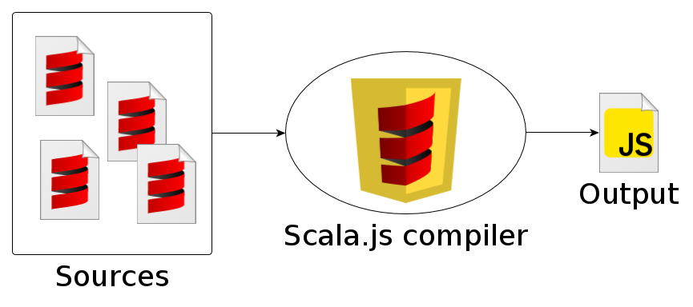
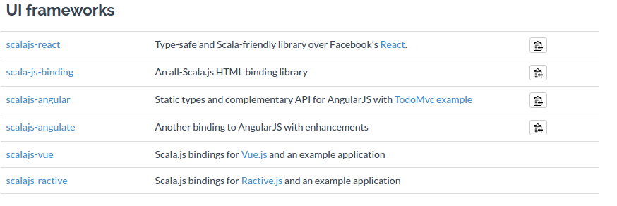
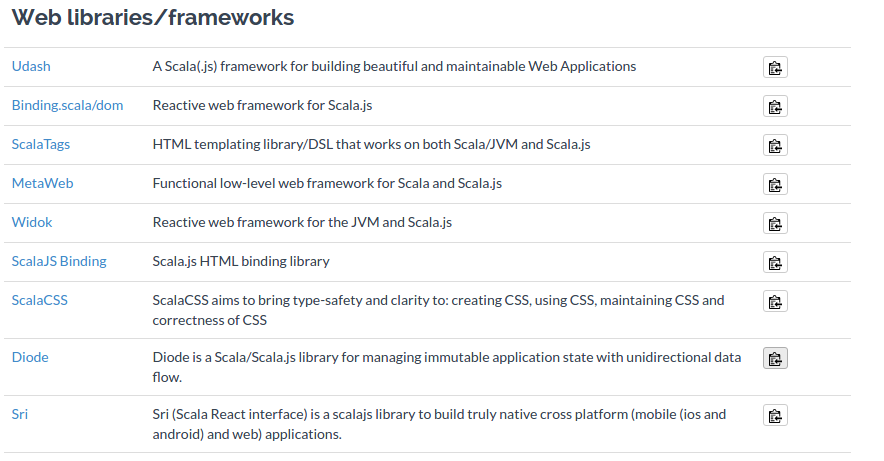
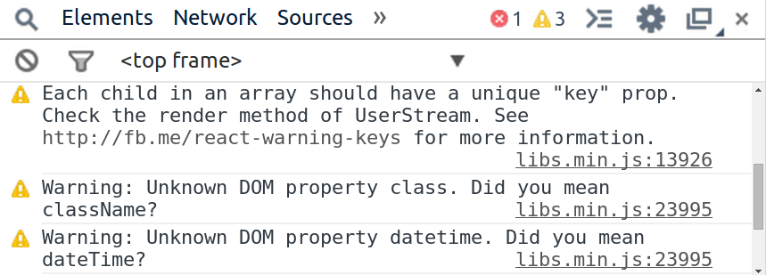
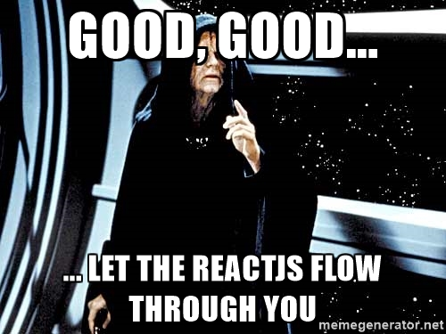

## Entwicklung einer Front-End 
### 

#HSLIDE

## Grundstein des Ganzen ist 


#VSLIDE

### Im Kern ist Scala.js ein Compiler.

Er Compiliert _.scala_ Dateien in einzeln optimierte und minimierte _.js_ Dateien



#VSLIDE

Was die Möglichkeit bietet die mächtigen Sprachfunktionen von Scala zu nutzen

#VSLIDE

Ein Compiler wäre aber nichts ohne ein Ökosystem aus Bibliotheken und Werkzeugen

Zum Glück deckt Scala.js auch das ab!

#VSLIDE

Scala.js bietet die Möglichkeit angepasste Scala und Javascript Bibliotheken einzubinden

#VSLIDE
 
(Da es hier um die Erstellung einer UI geht.
Werden hier nur die Relevanten Ausschnitte der Bibliotheken aus den Scala.js Docs gezeigt)

#VSLIDE

## JavaScript Bibliotheken

 
#VSLIDE

## Scala Bibliotheken
  

#VSLIDE

**AngularJS** wurde durch Vorgaben aus der Auswahl ausgeschlossen 


#HSLIDE

Die Entscheidung fiel auf die, 2013 von Facebook ins Leben gerufene <i>Javascript-Bibliothek</i>

#HSLIDE


## React(.JS)

#VSLIDE

## Warum React ?

-  Nahe an Bekannter Syntax 
-  Re-Render bei jeder Änderung 
-  Htmlcontent wird als Komponenten erzeugt 
-  Templates sind Debugfähig
-  Geschwindigkeit durch Virutellen DOM
-  Server Seitiges Rendering
-  Gute Fehlermeldungen
-  Gute Tesbarkeit durch pures JavaScript

#VSLIDE

## Was spricht gegen React?

- Benötigt Verständnis der Flux Struktur
- Benötigt zusätzliche Bibliotheken um eine Vollwertige App zu erstellen
- Sehr steile Lernkurve für Einsteiger


#VSLIDE


#HSLIDE

Ein näherer Blick auf die Möglichkeiten die React bietet:

#VSLIDE

## JSX

(<span style="color:#e49436">J</span>ava<span style="color:#e49436">S</span>cript<span style="color:#e49436">X</span>ML

Eine XML-ähnliche Syntax Erweiterung für JS
Vereinfacht die Handhabung

#VSLIDE

### Vanilla JS
```
render: function() {
    React.DOM.div({ className: 'my-thing' },
        React.DOM.a({ href: '/path' },
            'Link: ' + this.props.linkText
        )
    );
}
```
### JSX
```
render: function() {
    return (
        <div className="my-thing">
            <a href="/path">
                Link: {this.props.linkText}
            </a>
        </div>
    );
}
```

#VSLIDE

## Virtueller DOM

 Nie wieder eine _"echtes" **DOM**_-Element erstellen
 
 **React übernimmt das! <!-- .element: class="fragment" -->**
 
 Steigert die Geschwindigkeit

#VSLIDE

### Server-   <!-- .element: class="fragment" -->

### seitiges  <!-- .element: class="fragment" -->

### Rendering <!-- .element: class="fragment" -->

#VSLIDE

### Es ist alles Virtuell!
```
var EventList = require('path/to/event-list-component');
var SomeApi = require('path/to/some-api');
var Server = require('someHttpServer').listen(80);

Server.on('request', function(req, res) {

    SomeApi.getEvents(req.params.matchId)
        .then(function(err, events) {
            var html = React.renderComponentToString(
                new EventList({ events: events })
            );
    
            res.send(html);
        });
});
```

#VSLIDE

## Gute Fehlermeldungen


#VSLIDE

## Automatisch gebundene Funktionen
```
React.createClass({
    onClick: function(e) {
        // "this" bezieht sich auf die Komponente
        this.setState({ clicked: true });
    },

    render: function() {
        return <button onClick={this.onClick} />;
    }
});
```

#VSLIDE

### Eine **benötigt** Methode :

***<span class="fragment" style="color:#e49436">render()</span>*** 

#VSLIDE

## Props

Das _"externe Interface"_ zu den Komponenten.

**propTypes** erlauben die Validierung des Input

#VSLIDE

## State
Der Interne Komponenten Zustand

 ***<span class="fragment" style="color:#e49436">setState()</span>*** 

Führt zu einem Re-Renderen der Komponenten <!-- .element: class="fragment" -->

#HSLIDE


## Die Flux Struktur
 

Es ist nicht pflicht sie zu verwenden wird jedoch in Verbindung mit React.js empfohlen

#VSLIDE

Daten in Flux Applikationen fließen in eine Richtung


#VSLIDE

Die Views können neue Actions auf Grund von Userinteraction auslösen


#HSLIDE

## Danke für Ihre Aufmerksamkeit!
